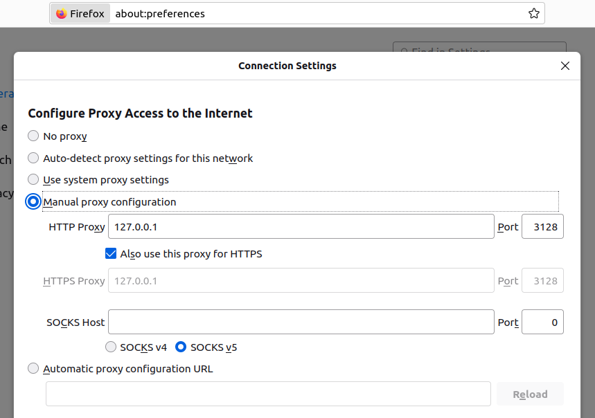

# squid-transparent-proxy

Simple out-of-the-box config to do URL filtering using Squid

# How to

1. Build the container

```shell
docker build . --tag mysquid
```

2. Run it

```shell
docker run -v $(pwd)/squid.conf:/etc/squid/squid.conf \
           -v $(pwd)/allowed_domains.conf:/etc/squid/allowed_domains.conf \
           -p 3128:3128 \
           mysquid:latest
```

3. Points your browser config at it



4. Adapt the allowed websites by editing `allowed_domains.conf`

# Todo

* check if we can redirect to an error page for un-authorized HTTPS sites (instead of a 403).
* add default to do proper logging and caching
